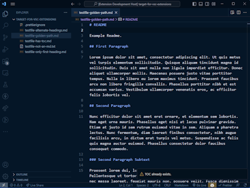
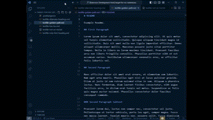
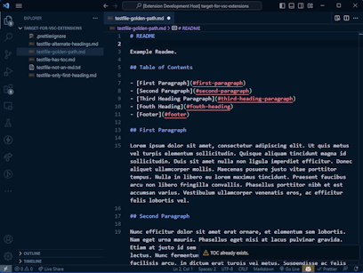

# Create Markdown TOC README

Locates all Level 2 headings in the currently selected markdown file and creates a clean, orderly table of contents near the top of the document. As expected, the table of contents entries link to all discovered Level 2 heading labels within the document, simplifying navigation.

## Features

- Creates a table of contents in the currently open markdown file just prior to the 1st Level 2 heading.
- Links to Level 2 headings are stored in the generated table of contents.
- Supports standard Headings (prefixed with `#`) and alternate Headings syntax (`=` or `-` characters on nextline following heading title).
- Will try to put the generated Table of Contents near the top of the document if there is no Level 1 Heading.
- Attempts to be non-destructive but will strip-out Heading characters that link fragments do not support.
- Uses the VSCode Command Palette to insert the new table of contents.

See [CHANGELOG.md](./CHANGELOG.md) for details.

## About This Extension

Open a Markdown File with Headings in it.

---

Open Command Palette to find "Create Table of Contents".

---

Select the command and a Table of Contents will be created with Heading IDs linked up.

---

## Requirements

The only dependencies are `vscode ^1.90.0 and those listed in devDependencies in the package.json file in my [GitHub Project Repo](https://github.com/nojronatron/markdown-toc/).

## Extension Settings

Contributes.Command: `markdown-toc.createTOC` "Create Table of Contents"

ActivationEvents: none.

## Known Issues

- Always use a Markdown Linter before running this tool for the best results.
- A Level 1 Heading must be followed by a newline character or it will be ignored (note: Table of Contents generation does not depend on any Level 1 heading specifically).
- Headings that start with a space may cause Create ToC to ignore the heading.
- Headings that contain characters other than alpha-numerics will likely be processed _but_ the generated Table of Contents link might not be active.
- Skipped level 2 headings will not be shown in the generated Table of Contents.

_Note_: See [GitHub Issues List](https://github.com/nojronatron/markdown-toc/issues) for the most current status.

## Release Notes

This release adds the ability to detect both Standard style and Alternate style level 1 and level 2 headings. In both cases, the generated Table of Contents anchors link fragments to the headings near the top of the existing markdown document.

See [CHANGELOG.md](./CHANGELOG.md) for detailed release notes.

---

## Credits

Design, code, test, and publisher: Jon Rumsey [GitHub](https://github.com/nojronatron) [LinkedIn](https://www.linkedin.com/in/jonathan-rumsey-wa)

## References

- Markdown Rules guidance from [DavidAnson's Markdown Lint repo](https://github.com/DavidAnson/markdownlint/blob/main/doc/Rules.md)
- GitIgnore suggestions from [TopTal.com](https://www.toptal.com/developers/gitignore/api/visualstudiocode)
- Guidance on how to create a VS Code Extension from MSFT Learn [VS Code Docs](https://code.visualstudio.com/api/get-started/your-first-extension)
